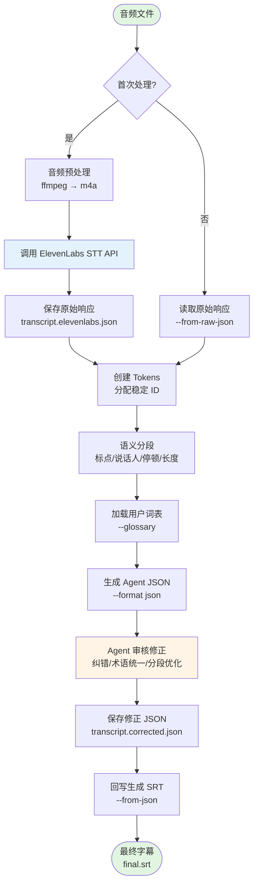

# Transcribe2sub Skill

一个提供音频/视频转高质量 SRT 字幕的能力的 Skill。基于 ElevenLabs STT API，支持:

- Word-level 时间戳
- Token 级边界控制
- Agent 可回放修订
- ASR 错词纠正
- 术语统一（支持用户词表）
- 语义分段优化

## Workflow



### 典型使用流程

1. **首次转录**: 音频 → JSON
2. **Agent 修正**: 审核纠错、统一术语
3. **生成字幕**: JSON → SRT

推荐命名约定:

- 机器初稿: `<stem>.review.json`
- review 后文件: `<stem>.corrected.json`


## 依赖

- Node.js >= 20
- pnpm
- ffmpeg

## 安装

### 自动安装

使用 AI Agent 自带的 Skill 安装 Skill 进行安装。

安装完成后，第一次实际使用前，还需要进入 skill 目录运行一次 `pnpm install`。如果当前环境限制依赖安装，需要先批准提权再执行。

### 手动安装

```bash
cp -r skills/transcribe2sub/ /path/to/your/ai/agent/skills/transcribe2sub/
cd /path/to/your/ai/agent/skills/transcribe2sub/
pnpm install
```
